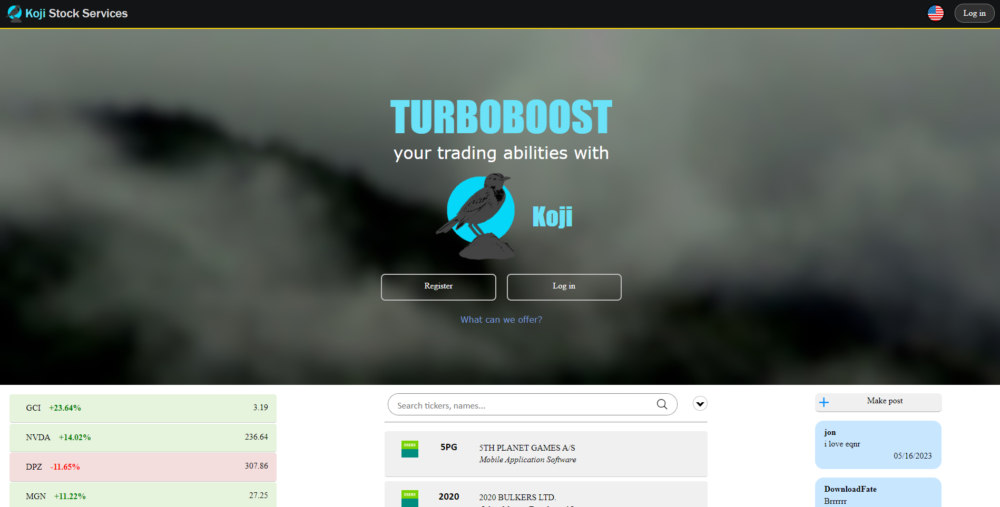
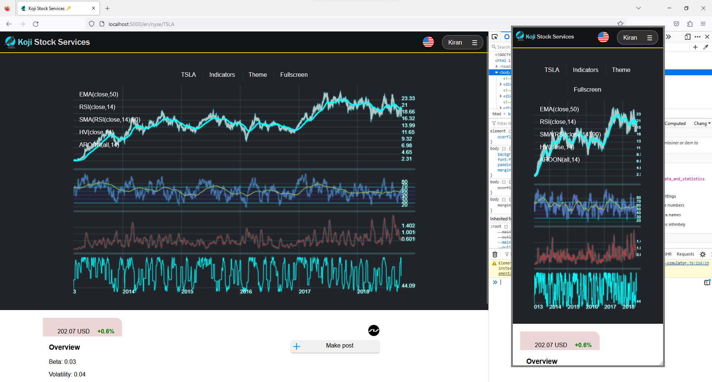
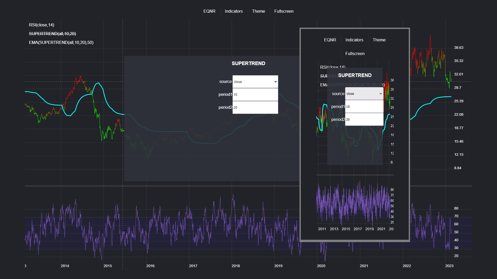
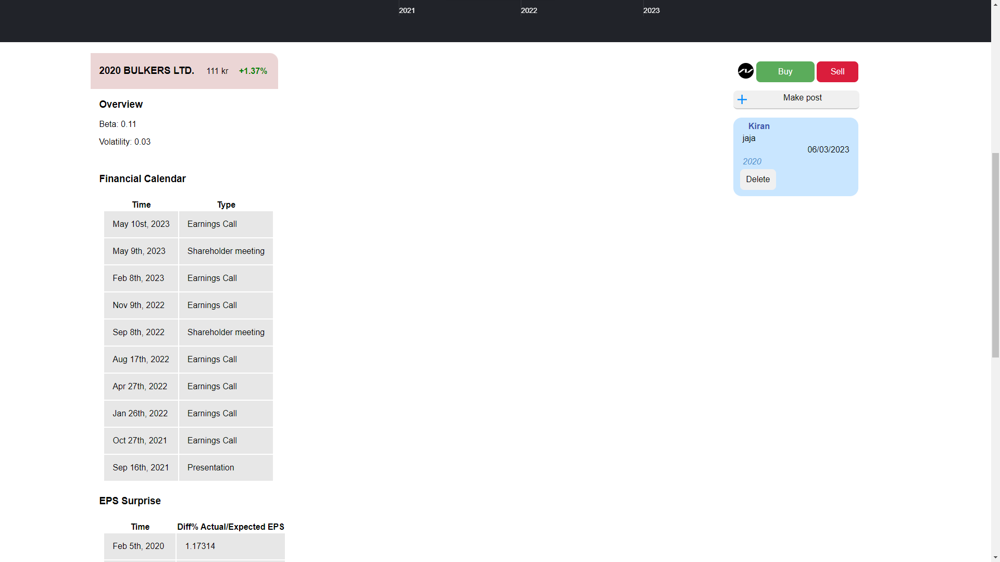
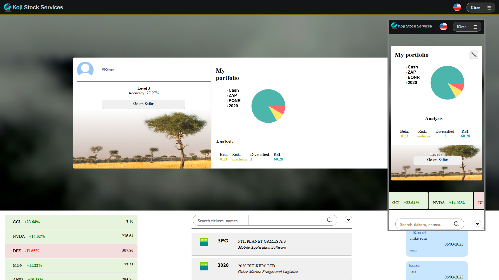

# About Koji Stock Services
Koji Stock Services (KSS) is a website for viewing stock data and making informed stock purchases with public stock data and user-generated content. KSS is built on the Flask library for python.

# Presentational video

Check out our <a href="https://youtu.be/9h2KTb__iZI">youtube video</a>.

# Features
<table>
<tr>

<td>
Index
</td>
<td>
View stock
</td>

</tr>
<tr>

<td>
Search db for financial instruments.
  The index page will display portfolio and Safari minigame statistics if the user is logged in, otherwise a prompt to log in or register will be displayed.
  Directly below the banner image, you can view recent posts (limited num posts), hot stocks (sorted by the magnitude of their development), and available stock data.
  
  
  Can change language in top-right corner, and login or go to settings. 
  Can create posts if logged in, and can add tags (marked with '#' at the beginning of a word). Posts can be deleted (if user id is the same)
</td>
<td>
Display stock data stored in database (uses js fetch to query server for JSON file). If the user is logged in, more data will be displayed, otherwise the user will be prompted to log in (at the bottom of the page). If price history is not available in database, or query is unsuccessful, price graph will be replaced by an error message.
Users may comment on stocks, which will be pushed to the feed, tagged with the name of the stock and any other tags the user appends.
If price history is found, user can add filters and indicators on top of the price graph to view different gauges of performance, such as filters (moving averages), oscillators, momentum, etc, with custom adjustable parameters. Filters are stackable, i.e. you can graph a smoother RSI curve by applying a moving average over it. Data transfer has been minimized to the greatest extent possible without compromising computer power. Users can also change chart themes to for example colored which gives them an advantage in the market by displaying the price as red, or green when it is well below a moving average since the idea is to buy low and sell high. Users can also enter fullscreen mode. Dates and prices will automatically adjust to scrolling or zooming in and out, depending on your screen size. 
</td>

</tr>

<tr>

<td>
View users
</td>
<td>
Safari mode
</td>

</tr>
<tr>

<td>
Clicking on your username in index.html (log in to see username and portfolio) leads you to /user/{user id}, which is a simplified view of your user data, which can be shared with others.
</td>
<td>
  Contains a minigame where users can guess if a certain stock will move up or down, given the latest 2 months of price history. Correct and incorrect guesses are appended to the users data, which are used to calculate accuracy in index.html.
</td>

</tr>

<tr>

<td>
Settings:
</td>
<td>
Login/register:
</td>

</tr>
<tr>

<td>
Users can change their username and password. Changing your username does not update the post's author attribute.
</td>
<td>
Login and registering new users implemented. Basic criteria for passwords, and usernames may not overlap (to avoid confusion). Usernames have a simple profanity filter. Error messages display using the base template's 'displayErr' method, which is stored in helpers.js. New users are given a random identifier and saved in data/users.json, in the 'public_users' object.
</td>

</tr>
</table>

Complementary features include:
An admin user that can ban users on the /user/{user id} route. A banned user will not be able to login, but will see an error message informing them that they have been banned.

# Accessibility
  To explore the features listed, we provide two login credentials. Public users have by default no special authority or privileges. The admin user has the highest authority and can ban people by visiting their id page.
  <table>
    <tr>
      <td>
Credentials for test public user:
      </td>
      <td>
   Username: jon
   Password: abc123
      </td>
    </tr>
    <tr>
      <td>
Credentials for test private user:
      </td>
      <td>
   Username: admin
   Password: admin123
      </td>
    </tr>
  </table>
Test banning of public users: log in as admin and visit /user/0000001. On desktop you will see an option to ban user in top left of user data box. On mobile this option is hidden for cleanliness. 
  
# Data
We have chosen to use JSON for our database since it provides an easy way to view all your data and is relatively fast to update in large quantities.
Our database is contained in the 'data' folder, in which the following substructure can be found:
 &nbsp;indices/
 &nbsp;&nbsp;&nbsp;osebx.json
 &nbsp;latest/
 &nbsp;&nbsp;&nbsp;prices.json
 &nbsp;social/
 &nbsp;&nbsp;&nbsp;posts.json
 &nbsp;stocks/
 &nbsp;&nbsp;&nbsp;<market>/<ticker>.json
 &nbsp;tickers.json
 &nbsp;users.json

# Preview
Below is a screenshot of index.html when user is not logged in. As well a a couple of other images of the site.

